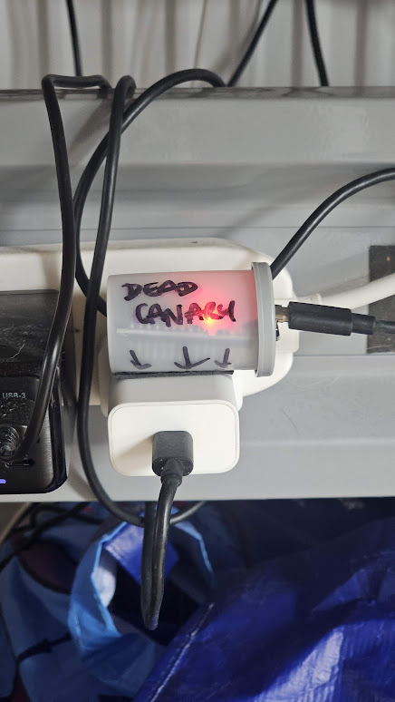
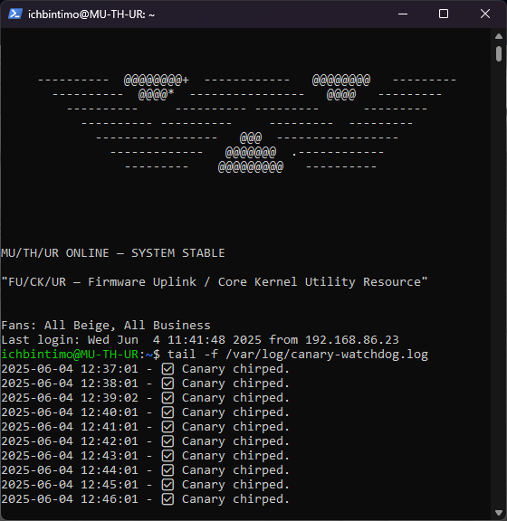

# 🕊️ Dead Canary

A LAN-connected watchdog using an ESP32 that safely shuts down your NAS or server when power is lost — like a literal canary in a server mine.

UPDATED TO INCLUDE SCREEN AND WIFI FALLBACKS
---

## What is it?

My Zimacube NAS (MU/TH/UR) runs on a basic UPS without NUT or similar. I wanted a reliable, local-only way to detect when the **power goes out** — and shut things down cleanly before ZFS could cry.

Enter: **Dead Canary**  
An ESP32 sits on the same power strip as the NAS (but **not** on the UPS), and serves a local `/` endpoint returning `"CHIRP"`. When that chirp goes silent, the NAS knows it’s time to go dark.

NOW WITH TIMESTAMPS IN THE LOG, AND FULL DELAYED WOL
---

## What You Need

- ESP32 development board
- Arduino IDE
- A Linux server or NAS
- Local Wi-Fi
- (Optional) Hipster film cannister for housing

---

## How It Works

### ESP32 Firmware
- Connects to Wi-Fi
- Hosts a webserver on port 80
- Responds to `http://CANARY_IP/` with `"CHIRP"`

### Server Watchdog
- Cron job pings the canary every minute
- If no chirp in 5 minutes, triggers:
  ```bash
  shutdown -h now


## Installation

### 1. Flash the ESP32 with `canary-esp32.ino`

- Update `ssid` and `password` with your Wi-Fi credentials
- Upload the sketch using Arduino IDE
- Use Serial Monitor to see the assigned IP

### 2. Install the watchdog script on your NAS/sever

Place the script:

```bash
sudo nano /usr/local/bin/canary-watchdog.sh
```

Make it executable:

```bash
sudo chmod +x /usr/local/bin/canary-watchdog.sh
```

Add it to root’s crontab to run every minute:

```bash
sudo crontab -e
```

Then add this line:

```cron
* * * * * /usr/local/bin/canary-watchdog.sh >> /var/log/canary-watchdog.log 2>&1
```

---

## 🧪 Testing

To simulate power loss:

- Unplug the ESP32 or disconnect its Wi-Fi
- After 5 minutes of silence, the NAS will shut down
- (Optional) Replace `shutdown -h now` with a log echo to test safely

---

## Bonus Layer

- I used [Uptime Kuma](https://github.com/louislam/uptime-kuma) to monitor the Canary IP.
- If the MU/TH/UR is still up but Kuma alerts me, I know the ESP has been unplugged (likely by Arnold the cat).

---

## Final Notes

- ESP32 must **not** be powered by the UPS
- No cloud dependencies
- Local, autonomous, and extremely reliable


---

## Build

### Dead Canary in Hand


### Mounted to Power Strip (VHB-taped, not on UPS)


### Fake Shutdown Test Confirmed
.jpg)

### Updated Log output



